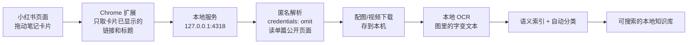

<div align="center">


# 收藏 (ShouCang)

**专治收藏夹吃灰 —— 把存过的小红书笔记，变成随时搜得到的本地知识库。**


</div>

---

## 这是什么

小红书收藏夹最大的问题不是「存了不看」，而是**想找的时候找不到**：

- 收藏夹不支持搜正文，存了三百条想找那条讲配色的，翻不到
- 干货全写在图片里，搜索框对图里的字完全无能
- 笔记被作者删除、限流后，收藏只剩一张灰色占位图

「收藏」的思路很简单：**把你手动拖进来的那几条笔记，完整抄一份到本地。** 正文、配图、图里的文字、视频，一次性扒干净存下来。之后搜关键词就能命中，原帖删了也不影响你。

**全程本地，不依赖任何云服务。**

## 功能

| 能力 | 说明 |
|---|---|
| 拖拽导入 | 从小红书页面把笔记卡片直接拖进应用 |
| 本地 OCR | 图片里的文字变成可搜索文本（Windows.Media.Ocr / macOS Vision） |
| 语义搜索 | 本地嵌入模型（e5-base），按意思搜，不只按字面搜 |
| 自动分类 | 标题/正文/OCR/标签加权打分，自动归入 9 个类目 |
| 视频笔记 | 视频下载到本地，离线可播放 |
| Agent 可读 | 内置 MCP server，Claude Code / Codex / Hermes 直接检索你的笔记库 |

## 快速开始

### 1. 安装桌面应用（Windows）

从 [Releases](https://github.com/Jisiyong-A/shoucang/releases) 下载 `ShouCang-Windows-x64-0.1.0-setup.exe`，双击安装。

无需安装 Node / Python / Rust。数据保存在 `%LOCALAPPDATA%\com.patrick.shoucang\`，重装/卸载都不丢。

### 2. 安装 Chrome 扩展

1. 打开 `chrome://extensions`
2. 右上角开启**开发者模式**
3. 点击**加载已解压的扩展程序**，选择仓库里的 `browser-extension/` 目录

扩展权限只有 `http://127.0.0.1:4318/*`（本地回环）——没有 `tabs`、没有 `cookies`、没有 `webRequest`，技术上就不具备读账号凭证的能力。

### 3. 开始用

打开小红书笔记页，把笔记卡片**拖进应用窗口**（或拖详情页右下角按钮）。应用依次执行：识别 → 匿名解析 → 下载图片/视频 → 本地 OCR → 自动分类 → 收录完成。

## 工作原理



## 隐私与封控风险

**不是爬虫。** 不读你的 Cookie、不用你的登录态、不批量抓取、不做定时任务：

- 解析请求显式 `credentials: 'omit'`，不携带任何 Cookie；失败直接报错，**不会回退到你登录着的浏览器**
- 图片只从 `.xhscdn.com` / `.xhsimg.com` 下载，其他域名直接拒绝
- 服务只监听 `127.0.0.1`，数据全程本机
- 语义模型、OCR、WASM 运行时全部随应用打包，**运行时不联网**
- 没有代理池、没有 UA 伪装、没有重试退避——爬虫标配一个都没有

> 严格说没有任何工具能承诺 100% 安全。但这里的请求模式和你自己用浏览器点开一篇笔记基本没区别，且不涉及任何账号行为，风险很低。

## 数据

```
%LOCALAPPDATA%\com.patrick.shoucang\
├── notes.json          # 全部笔记（正文、OCR、元数据）
└── media/<noteId>/     # 每条笔记的配图与视频
```

- **备份**：直接拷走这个文件夹
- **彻底删除**：删掉这个文件夹，应用回到空白状态
- 仓库不包含任何笔记数据，`.gitignore` 已挡住

## 接入 AI（MCP）

应用内「设置 → Agent」一键连接，或手动注册：

```bash
# Claude Code
claude mcp add --scope user shoucang-notes \
  -e "LOCAL_APP_DATA_DIR=%LOCALAPPDATA%\com.patrick.shoucang" \
  -- node <repo>\scripts\shoucang-mcp.mjs

# Codex / Hermes 同理（见仓库 docs）
```

两个**只读**工具：`search_saved_notes`（标题/正文/OCR/标签/作者/分类搜索）、`read_saved_note`（完整正文 + 逐图 OCR）。只读本机数据，不联网、不碰小红书账号。

## 技术栈

- **桌面**：Tauri 2（Rust）+ WebView2 / WKWebView
- **前端**：Next.js 16 静态导出 · React 19 · Framer Motion · Tailwind 4
- **本地服务**：Node.js sidecar（零依赖，纯标准库）
- **OCR**：Windows.Media.Ocr（WinRT）/ macOS Vision，双平台纯本地
- **语义搜索**：multilingual-e5-base（ONNX int8）+ WASM 推理，浏览器内离线运行
- **Android 路线**：`src-tauri/storage/` 独立 Rust crate（SQLite + FTS5 + 向量检索，29 测试），与桌面共享核心

## 从源码构建

```bash
git clone https://github.com/Jisiyong-A/shoucang.git
cd shoucang
npm install

# 桌面版
npm run tauri:build        # → src-tauri/target/release/bundle/nsis/

# 开发模式
npm run dev                # 前端 :1420
npm run local-api          # 本地服务 :4318
```

测试：

```bash
npm test                    # 74 tests（node:test）
npm run lint
cd src-tauri/storage && cargo test   # 29 tests（Rust 核心）
```

## 已知限制

- 小红书页面改版后，扩展的 DOM 选择器需要跟着更新
- 匿名解析可能失败（风控/登录墙）：这是设计如此——**宁可导不进来，也不动你的账号**
- 不支持批量导入与收藏夹同步：一次一条，你手动触发

## License

[AGPL-3.0-or-later](LICENSE) —— 可以商用、可以改，但修改后对外分发或提供网络服务，必须以同样的协议公开改动源码。
